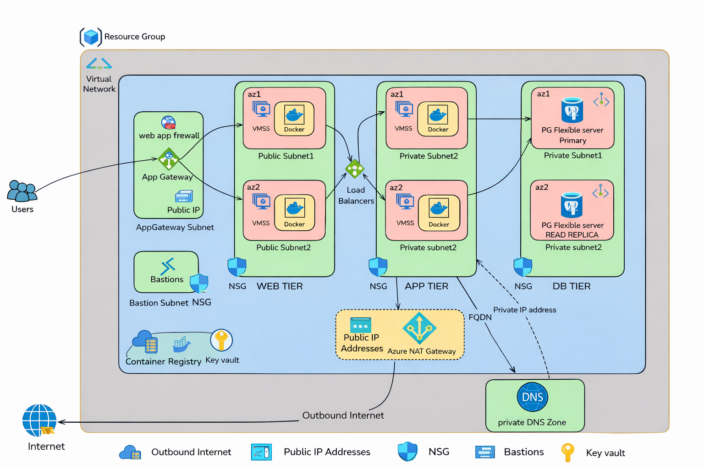

# Azure 3-Tier Architecture with Terraform

## 📌 Overview

This project provisions a complete **3-tier architecture on Microsoft Azure** using **Terraform**. It demonstrates infrastructure-as-code best practices including modular design, remote state management, and containerized application deployment.

The architecture includes:

* 🌐 Networking (VNet, subnets, NSGs)
* 🖥️ Compute (App services / containers)
* 🗄️ Database (Azure PostgreSQL Flexible Server)
* 🔐 Security and private networking
* 📦 Docker-based frontend and backend services

---

## 🏗️ Architecture




```
Frontend (Docker) ---> Backend (Docker) ---> PostgreSQL Database
        |                   |
     Public Subnet     Private Subnet
```

> 📝 **Credit:** This project is inspired by a tutorial by **Piyush**. Huge thanks for the original walkthrough.
>
> ⚠️ **Note:** An issue related to Azure region availability was encountered in the original setup. This implementation fixes it by deploying resources in **Central US (centralus)** to avoid the restriction.

---> Backend (Docker) ---> PostgreSQL Database
|                   |
Public Subnet     Private Subnet

```

---

## 🚀 Features

- Infrastructure provisioned using **Terraform modules**
- Remote state stored in **Azure Storage Account**
- Secure networking with **private subnets and NSGs**
- Containerized apps using **Docker images from Docker Hub**
- Scalable and production-ready structure

---

## 📁 Project Structure

```

.
├── infra/
│   ├── modules/
│   │   ├── networking/
│   │   ├── compute/
│   │   ├── database/
│   │   └── dns/
│   ├── environments/
│   │   └── prod/
│   │       └── terraform.tfvars
│   └── main.tf

````

---

## ⚙️ Prerequisites

Make sure you have installed:

- Terraform
- Azure CLI
- Git
- Docker

Login to Azure:

```bash
az login
````

---

## 🗂️ Backend Setup (Remote State)

Create resource group:

```bash
az group create --name tfstate-rg --location eastus2
```

Create storage account:

```bash
az storage account create \
  --name tfstate<unique_suffix> \
  --resource-group tfstate-rg \
  --location eastus2 \
  --sku Standard_LRS
```

Create container:

```bash
az storage container create \
  --name tfstate \
  --account-name tfstate<unique_suffix> \
  --auth-mode login
```

---

## ▶️ Deployment Steps

Navigate to infra directory:

```bash
cd infra
```

Initialize Terraform:

```bash
terraform init \
  -backend-config="resource_group_name=tfstate-rg" \
  -backend-config="storage_account_name=tfstate<unique_suffix>" \
  -backend-config="container_name=tfstate" \
  -backend-config="key=prod.terraform.tfstate" \
  -backend-config="use_azuread_auth=true"
```

Apply Terraform:

```bash
terraform apply \
  -var-file="environments/prod/terraform.tfvars" \
  -var="dockerhub_username=YOUR_DOCKERHUB_USERNAME" \
  -var="dockerhub_password=YOUR_DOCKERHUB_PAT" \
  -var="frontend_image=YOUR_DOCKERHUB_USERNAME/frontend:latest" \
  -var="backend_image=YOUR_DOCKERHUB_USERNAME/backend:latest"
```

---

## 🔐 Security Notes

* Do NOT commit:

  * `.terraform/`
  * `*.tfstate`
  * `*.tfvars` (if containing secrets)
  * Docker or Azure credentials

Use environment variables for sensitive values.

---

## 🧹 Cleanup

To destroy all resources:

```bash
terraform destroy
```

---

## 📈 Future Improvements

* Add CI/CD with GitHub Actions
* Use Key Vault for secrets management
* Add monitoring (Azure Monitor / Log Analytics)
* Implement autoscaling

---

## 👤 Author

**Bill (Abanoub Emad)**

---

## ⭐ If you like this project

Give it a star ⭐ on GitHub!
